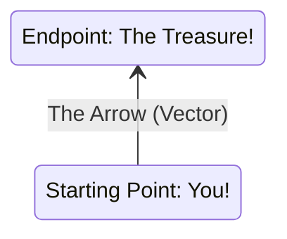

# **Linear Algebra Basics**

## Explain what a vector is in linear algebra with a simple visual analogy.

Imagine you're giving directions to a friend to find a specific spot in a park in Goa. Instead of just saying "Go that way," you'd probably be more specific, right?

**A Vector is like a precise set of instructions that tells you two things:**

1.  **How far to go (Magnitude):** This is the length of your journey in a particular direction.
2.  **Which way to go (Direction):** This points you exactly where you need to head.

**Simple Visual Analogy: An Arrow in Goa!**

Imagine you're standing at a starting point in the park (let's say, near the big banyan tree). A vector can be represented as an **arrow** starting from where you are:



-   **The length of the arrow** represents the **magnitude** – how many steps or meters you need to walk. A longer arrow means a greater distance.

-   **The direction the arrow is pointing** represents the **direction** you need to walk. If it points towards the north-east, that's the way you go.

**More specifically, if we think of a map of the park with coordinates (like on a graph):**

Let's say your starting point is at coordinates (0, 0). The vector to the treasure might take you:

-   **3 steps to the East**
-   **4 steps to the North**

We can represent this vector mathematically as:

```
[ 3 ]
[ 4 ]
```

This column of numbers tells you the "components" of the vector. The first number (3) tells you how much to move along the horizontal axis (East in this case), and the second number (4) tells you how much to move along the vertical axis (North).

**So, in summary:**

-   **A vector is more than just a number; it has both size (magnitude) and direction.**
-   **Visually, you can think of it as an arrow pointing from a starting point to an ending point.**
-   **Mathematically, in a coordinate system, a vector can be represented by its components, which tell you how much to move along each axis.**

Just like a precise arrow guides you to the treasure in the park, vectors are fundamental in AI and machine learning for representing things like the direction of movement, the intensity of a force, or even the features of an image or a piece of text in a multi-dimensional space. They give us a way to handle quantities that have both size and orientation.

---

## Explain what a matrix is in linear algebra with a simple example.

Okay, let's break down what a matrix is in linear algebra.

**Imagine you're organizing data in a table.** That's essentially what a matrix is!

**A Matrix is like a Spreadsheet:**

Think of a spreadsheet program like Excel or Google Sheets. You have rows going horizontally and columns going vertically, and you can put numbers, words, or other information in each cell.

A matrix is very similar:

-   It's a **rectangular arrangement** of numbers (or other mathematical objects).
-   These numbers are organized into **rows** (horizontal lines) and **columns** (vertical lines).

**Simple Example: Student Grades**

Let's say you have a table to store the grades of students in three subjects: Math, Science, and English.

| Student | Math | Science | English |
| :------ | :--- | :------ | :------ |
| Ali     | 90   | 85      | 78      |
| Bala    | 76   | 92      | 88      |
| Chitra  | 82   | 80      | 95      |

You can represent this information as a matrix:

```
[ 90  85  78 ]
[ 76  92  88 ]
[ 82  80  95 ]
```

-   Each **row** represents a student's grades.
-   Each **column** represents the grades for a particular subject.
-   The numbers inside the matrix are called **elements** or **entries**.

**Key things to remember about matrices:**

-   **Size:** We describe a matrix by its number of rows and columns. In the example above, it's a 3x3 matrix (3 rows, 3 columns).
-   **Notation:** We often use capital letters to name matrices (e.g., matrix A).
-   **Applications:** Matrices are incredibly useful for:
    -   Representing systems of equations
    -   Performing transformations (like rotations) in computer graphics
    -   Storing data in machine learning
    -   And much, much more!

So, in essence, a matrix is simply a structured way to organize data in rows and columns, making it easier for us to work with and manipulate that data mathematically.

---

## What are some basic operations you can perform with vectors and matrices (addition, subtraction, scalar multiplication)?

**I. Vector Operations**

Imagine you're giving a robot directions in Kanpur.

-   **Vector Addition:**

    -   **Analogy:** If you tell the robot, "First, go 5 meters East and 2 meters North," and then, "Go 3 meters East and 1 meter South," you're adding those two sets of instructions.
    -   **Math:** To add vectors, you add their corresponding components. If vector **a** is `[5, 2]` and vector **b** is `[3, -1]` (where the first number is East/West, and the second is North/South), then:

        ```
        a + b = [5 + 3, 2 + (-1)] = [8, 1]
        ```

    -   **Result:** The robot ends up going 8 meters East and 1 meter North.

-   **Vector Subtraction:**

    -   **Analogy:** If you tell the robot, "Go 5 meters East and 2 meters North," and then, "Go 3 meters East and 1 meter South, but _reverse_ that," you're subtracting the second set of instructions.
    -   **Math:** To subtract vectors, you subtract their corresponding components:

        ```
        a - b = [5 - 3, 2 - (-1)] = [2, 3]
        ```

    -   **Result:** The robot's net movement is 2 meters East and 3 meters North.

-   **Scalar Multiplication:**

    -   **Analogy:** If you tell the robot, "Go 5 meters East and 2 meters North, and then do that _three times_, " you're multiplying the vector by a scalar (the number three).
    -   **Math:** To multiply a vector by a scalar, you multiply each component of the vector by that scalar:

        ```
        3 * a = 3 * [5, 2] = [3 * 5, 3 * 2] = [15, 6]
        ```

    -   **Result:** The robot goes 15 meters East and 6 meters North.

**II. Matrix Operations**

Let's say you're organizing data about shops in Kanpur.

-   **Matrix Addition/Subtraction:**

    -   **Analogy:** If you have two tables showing the daily sales of shops in different locations, and you want to combine them, you add the tables.
    -   **Math:** You can add or subtract matrices only if they have the _same size_ (same number of rows and columns). You add/subtract corresponding elements:

        ```
        A = [ 1  2 ]   B = [ 4  5 ]
            [ 3  4 ]       [ 6  7 ]

        A + B = [ 1+4  2+5 ] = [ 5  7 ]
                [ 3+6  4+7 ]   [ 9 11 ]
        ```

    -   **Result:** The resulting matrix shows the combined sales for each shop and location.

-   **Scalar Multiplication:**

    -   **Analogy:** If you want to double all the prices in your price list (represented as a matrix), you multiply the matrix by 2.
    -   **Math:** You multiply every element in the matrix by the scalar:

        ```
        2 * A = 2 * [ 1  2 ] = [ 2*1  2*2 ] = [ 2  4 ]
                [ 3  4 ]       [ 2*3  2*4 ] = [ 6  8 ]
        ```

    -   **Result:** The resulting matrix shows the doubled prices.

**Important Notes:**

-   Matrix multiplication is a bit more complex than these operations and has specific rules about dimensions.
-   These basic operations are crucial for many AI and machine learning tasks, from manipulating data to performing calculations within algorithms.

---

## Why is linear algebra important for AI and Machine Learning?

Linear algebra is absolutely fundamental to AI and machine learning. It might seem abstract at first, but it's the language and toolkit that allows us to express and manipulate the complex data and operations involved in these fields.

Here's why linear algebra is so crucial:

**1. Data Representation:**

-   **Vectors and Matrices:** In AI and machine learning, data is often represented as vectors and matrices.
    -   For example, an image can be represented as a matrix of pixel values.
    -   A table of customer data (age, income, purchase history) can be represented as a matrix.
-   **High-Dimensional Data:** AI often deals with datasets with many features (high dimensions). Linear algebra provides efficient ways to handle and process this complex information.

**2. Transformations and Operations:**

-   **Linear Transformations:** Many AI algorithms involve transforming data from one space to another. Linear algebra provides the mathematical framework for these transformations, using matrices to represent operations like rotations, scaling, and projections.
-   **Matrix Operations:** Operations like matrix multiplication, addition, and decomposition are essential for:
    -   Calculating predictions in neural networks
    -   Processing data in various machine learning algorithms
    -   Performing dimensionality reduction

**3. Dimensionality Reduction:**

-   **Principal Component Analysis (PCA):** Linear algebra techniques like PCA help to reduce the number of variables in a dataset while preserving its most important information. This simplifies the data and makes it easier to process, visualize, and use for machine learning.

**4. Optimization:**

-   **Solving Linear Equations:** Many machine learning algorithms involve solving systems of linear equations to find optimal parameters (e.g., the coefficients in a linear regression model).
-   **Gradient Descent:** The optimization algorithm used to train neural networks relies heavily on linear algebra to calculate gradients and update model parameters.

**5. Concepts for Understanding Algorithms:**

-   **Eigenvalues and Eigenvectors:** These concepts are crucial for understanding techniques like PCA, which are used for data analysis and dimensionality reduction.
-   **Vector Spaces and Linear Independence:** These provide the mathematical foundation for understanding how data is organized and how algorithms manipulate it.

**In simpler terms:**

-   Linear algebra gives us the tools to represent and manipulate data in a way that computers can understand.
-   It provides efficient ways to perform calculations on large datasets.
-   It helps us understand the underlying workings of many AI algorithms.

Without a solid foundation in linear algebra, it's difficult to truly grasp the inner workings of many machine learning and AI techniques. It's the "math behind the magic" that enables us to build powerful and effective AI systems.
