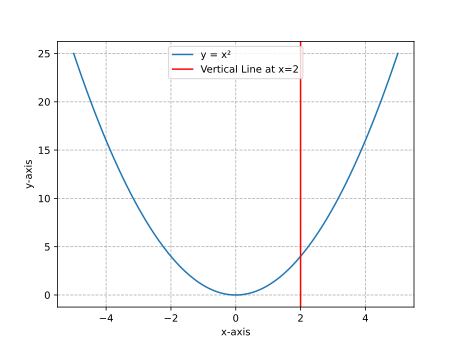

# **Functions**

## Chapter 20: Introduction to Functions

### Definitions

-   **Function**: A relation that assigns to each element in the **domain** exactly one element in the **range**.
-   **Domain**: The set of all possible input values (typically represented as \( x \)).
-   **Range**: The set of all possible output values (typically represented as \( f(x) \)).
-   **Independent Variable**: The input variable (\( x \)) whose value determines the output.
-   **Dependent Variable**: The output (\( f(x) \)) whose value depends on the input.
-   **Vertical Line Test**: A graphical method to determine if a curve represents a function. If any vertical line intersects the curve more than once, it is **not** a function.

### Forms or Classifications

#### Types of Functions

| Type of Function       | Notation                                                                                                                          | Description                                                                 | Example                                                                                 |
| ---------------------- | --------------------------------------------------------------------------------------------------------------------------------- | --------------------------------------------------------------------------- | --------------------------------------------------------------------------------------- |
| Linear Function        | \( f(x) = mx + b \)                                                                                                               | A straight line with slope \( m \) and y-intercept \( b \).                 | \( f(x) = 2x + 3 \)                                                                     |
| Quadratic Function     | \( f(x) = ax^2 + bx + c \)                                                                                                        | A parabola with a vertex and axis of symmetry.                              | \( f(x) = x^2 - 4 \)                                                                    |
| Piecewise Function     | \( f(x) = \begin{cases} \text{expression 1} & \text{if condition 1} \\ \text{expression 2} & \text{if condition 2} \end{cases} \) | A function defined by different expressions over different intervals.       | \( f(x) = \begin{cases} x & \text{if } x \geq 0 \\ -x & \text{if } x < 0 \end{cases} \) |
| Machine Learning Model | \( y = f(\mathbf{x}) \)                                                                                                           | A function mapping input features \( \mathbf{x} \) to a prediction \( y \). | \( \text{Price} = f(\text{Size, Location}) \)                                           |

### Examples

-   **Example 1: Evaluating a Function**

    -   **Problem**: Given \( f(x) = 3x - 5 \), find \( f(2) \) and \( f(-1) \).

    -   **Solution**:

        1. For \( f(2) \):
           \[
           f(2) = 3(2) - 5 = 6 - 5 = 1
           \]
        2. For \( f(-1) \):
           \[
           f(-1) = 3(-1) - 5 = -3 - 5 = -8
           \]

-   **Example 2: Domain and Range**

    -   **Problem**: Identify the domain and range of \( f(x) = \sqrt{x + 4} \).

    -   **Solution**:

        1. **Domain**: The expression under the square root must be non-negative:
           \[
           x + 4 \geq 0 \implies x \geq -4
           \]
           Domain: \( [-4, \infty) \).
        2. **Range**: The square root function outputs non-negative values:
           \[
           f(x) \geq 0
           \]
           Range: \( [0, \infty) \).

-   **Example 3: Vertical Line Test**

    -   **Problem**: Determine if the following graph represents a function.

    -   **Visualization**:

        

    -   **Solution**:

        1. The graph passes the vertical line test because any vertical line intersects the parabola at most once.
        2. Conclusion: The graph represents a function.

-   **Example 4: Piecewise Function**

    -   **Problem**: Evaluate the piecewise function \( f(x) = \begin{cases} 2x + 1 & \text{if } x < 0 \\ x^2 & \text{if } x \geq 0 \end{cases} \) at \( x = -2 \), \( x = 0 \), and \( x = 3 \).

    -   **Solution**:

        1. For \( x = -2 \) (use \( 2x + 1 \)):
           \[
           f(-2) = 2(-2) + 1 = -4 + 1 = -3
           \]
        2. For \( x = 0 \) (use \( x^2 \)):
           \[
           f(0) = 0^2 = 0
           \]
        3. For \( x = 3 \) (use \( x^2 \)):
           \[
           f(3) = 3^2 = 9
           \]

-   **Example 5: Real-World Application (Machine Learning)**

    -   **Problem**: A machine learning model predicts house prices based on square footage. The function is \( \text{Price} = 150 \times \text{Size} + 50,000 \). Predict the price for a house with \( \text{Size} = 1200 \) sq ft.

    -   **Solution**:

        1. Substitute \( \text{Size} = 1200 \) into the function:
           \[
           \text{Price} = 150 \times 1200 + 50,000 = 180,000 + 50,000 = 230,000
           \]
        2. The predicted price is \$230,000.

## Key Takeaways

> -   A **function** is a rule that assigns exactly one output to each input.
> -   The **domain** is the set of valid inputs, and the **range** is the set of possible outputs.
> -   The **vertical line test** determines if a graph represents a function.
> -   Functions can model real-world relationships, such as machine learning models.
> -   **Piecewise functions** use different rules for different intervals of the domain.
