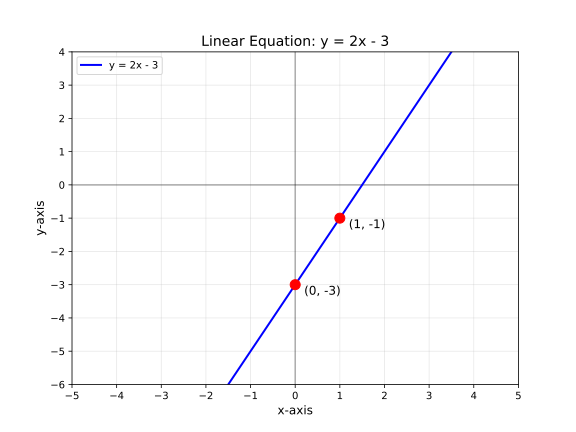
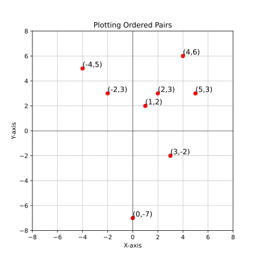
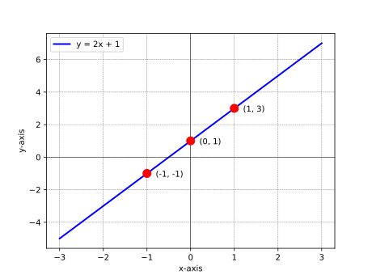
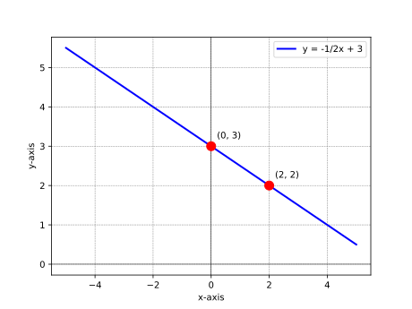
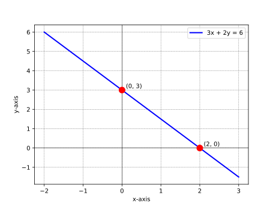
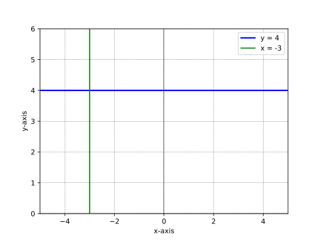
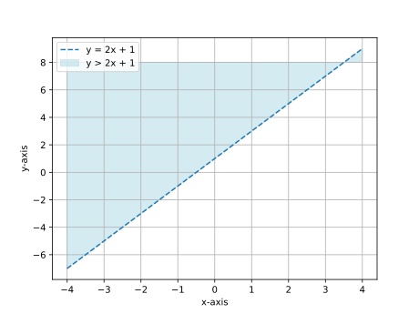
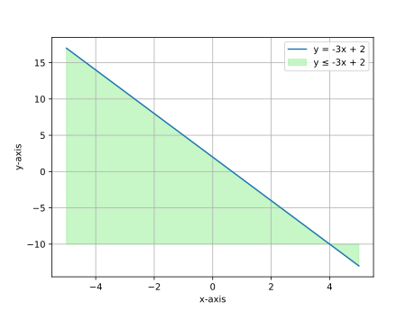
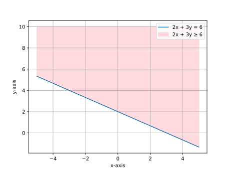
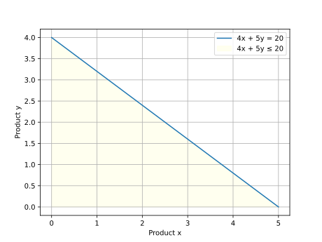

# **Graphing**

1.  **Cartesian Coordinate Plane**: A two-dimensional plane formed by two perpendicular number lines (the x-axis and y-axis) that intersect at the origin (0, 0).
2.  **Origin**: The central point of the Cartesian plane at \((0,0)\).
3.  **Ordered Pair**: A pair of numbers $(x, y)$ that represents a point in the Cartesian plane, where $x$ is the horizontal distance from the origin and $y$ is the vertical distance.

4.  **Quadrants**: The four sections of the Cartesian plane, divided by the x-axis and y-axis:

    -   Quadrant I: \(x > 0, y > 0\)
    -   Quadrant II: \(x < 0, y > 0\)
    -   Quadrant III: \(x < 0, y < 0\)
    -   Quadrant IV: \(x > 0, y < 0\)

5.  **Collinear Points**: Points that lie on the same straight line.

## Chapter 13: Linear Equations in Two Variables

### Definitions

-   **Linear Equation in Two Variables**: An equation of the form $Ax + By = C$, where $A$, $B$, and $C$ are constants, and $A$ and $B$ are not both zero.

-   **Solution to a Linear Equation**: Any ordered pair $(x, y)$ that, when substituted into the equation, makes the equation true.

-   **Slope**: A measure of the steepness and direction of a line, typically denoted by $m$. It represents the ratio of the vertical change to the horizontal change between any two points on the line.

-   **x-intercept**: The point where a line crosses the x-axis (has the form $(a, 0)$).

-   **y-intercept**: The point where a line crosses the y-axis (has the form $(0, b)$).

### Forms of Linear Equations

#### Standard Form

$Ax + By = C$

-   Useful for finding x and y intercepts
-   x-intercept: $(\frac{C}{A}, 0)$ when $B \neq 0$
-   y-intercept: $(0, \frac{C}{B})$ when $A \neq 0$

#### Slope-Intercept Form

$y = mx + b$

-   $m$ is the slope of the line
-   $b$ is the y-intercept
-   Directly shows how $y$ changes as $x$ changes

#### Point-Slope Form

$y - y_1 = m(x - x_1)$

-   $m$ is the slope of the line
-   $(x_1, y_1)$ is a point on the line
-   Useful when a point and slope are known

### Examples

-   **Example 1: Converting Between Forms**

    -   Problem: Convert the equation $3x + 2y = 6$ to slope-intercept form.
    -   Solution:
        1. Start with $3x + 2y = 6$
        2. Solve for $y$:
            $$
            2y = 6 - 3x \implies
            y = \frac{6 - 3x}{2}
            $$
            $$
            y = \frac{6}{2} - \frac{3x}{2} \implies
            y = 3 - \frac{3}{2}x
            $$
            $$
            y = -\frac{3}{2}x + 3
            $$
        3. Now in slope-intercept form, we can identify:
            - Slope $m = -\frac{3}{2}$
            - y-intercept $b = 3$, or point $(0, 3)$

-   **Example 2: Finding Intercepts**

    -   Problem: Find the x and y intercepts of the line $4x - 5y = 20$.
    -   Solution:
        1. For x-intercept, set $y = 0$:
            $$
            4x - 5(0) = 20 \implies
            4x = 20
            $$
            $$
            x = 5
            $$
            So the x-intercept is at point $(5, 0)$
        2. For y-intercept, set $x = 0$:
            $$
            4(0) - 5y = 20 \implies
            -5y = 20
            $$
            $$
            y = -4
            $$
            So the y-intercept is at point $(0, -4)$

-   **Example 3: Graphing a Linear Equation**

    -   Problem: Graph the line $y = 2x - 3$.
    -   Solution:
        1. Identify the slope $m = 2$ and y-intercept $b = -3$
        2. Plot the y-intercept: $(0, -3)$
        3. Use the slope to find another point:
           Starting from $(0, -3)$, move 1 unit right and 2 units up to get $(1, -1)$
        4. Draw a line through these points

    

-   **Example 4: Finding the Equation of a Line**

    -   Problem: Find the equation of a line passing through the points $(2, 5)$ and $(4, 9)$.
    -   Solution:
        1. Calculate the slope:
            $$
            m = \frac{y_2 - y_1}{x_2 - x_1} = \frac{9 - 5}{4 - 2} = \frac{4}{2} = 2
            $$
        2. Use point-slope form with $(x_1, y_1) = (2, 5)$:
            $$
            y - 5 = 2(x - 2) \implies
            y - 5 = 2x - 4
            $$
            $$
            y = 2x - 4 + 5 \implies
            y = 2x + 1
            $$
        3. The equation in slope-intercept form is $y = 2x + 1$, with slope $m = 2$ and y-intercept $b = 1$

-   **Example 5: Parallel and Perpendicular Lines**

    -   Problem: Find the equation of a line that passes through the point $(3, 4)$ and is:
        a) Parallel to the line $y = 2x - 5$
        b) Perpendicular to the line $y = 2x - 5$
    -   Solution:
        a) Parallel lines have the same slope. Line $y = 2x - 5$ has slope $m = 2$.

        1. Use point-slope form with $m = 2$ and $(x_1, y_1) = (3, 4)$:
            $$
            y - 4 = 2(x - 3) \implies
            y - 4 = 2x - 6
            $$
            $$
            y = 2x - 6 + 4 \implies
            y = 2x - 2
            $$
        2. The parallel line equation is $y = 2x - 2$

        b) Perpendicular lines have slopes that are negative reciprocals: $m_1 \times m_2 = -1$

        1. Original line has slope $m_1 = 2$, so perpendicular slope $m_2 = -\frac{1}{2}$
        2. Use point-slope form with $m = -\frac{1}{2}$ and $(x_1, y_1) = (3, 4)$:
            $$
            y - 4 = -\frac{1}{2}(x - 3) \implies
            y - 4 = -\frac{1}{2}x + \frac{3}{2}
            $$
            $$
            y = -\frac{1}{2}x + \frac{3}{2} + 4 \implies
            y = -\frac{1}{2}x + \frac{3}{2} + \frac{8}{2}
            $$
            $$
            y = -\frac{1}{2}x + \frac{11}{2}
            $$
        3. The perpendicular line equation is $y = -\frac{1}{2}x + \frac{11}{2}$

-   **Example 6: Application in Data Analysis**
    -   Problem: A dataset shows the relationship between study time (x) in hours and test score (y) in percentage. Data points: $(1, 65)$, $(2, 70)$, $(3, 75)$, $(4, 80)$. Find the linear equation that models this relationship and predict the score for 5 hours of study.
    -   Solution:
        1. Calculate the slope using the first and last points:
            $$
            m = \frac{80 - 65}{4 - 1} = \frac{15}{3} = 5
            $$
        2. Use point-slope form with $(x_1, y_1) = (1, 65)$:
            $$
            y - 65 = 5(x - 1) \implies
            y - 65 = 5x - 5
            $$
            $$
            y = 5x - 5 + 65 \implies
            y = 5x + 60
            $$
        3. The model is $y = 5x + 60$, which means each additional hour of study increases the score by 5 percentage points, with a base score of 60% for 0 hours of study.
        4. Prediction for 5 hours:
            $$
            y = 5(5) + 60 = 25 + 60 = 85
            $$
            With 5 hours of study, the predicted test score is 85%.

### Key Takeaways

> -   A linear equation in two variables ($Ax + By = C$) represents a straight line when graphed on a Cartesian coordinate plane.
> -   Every point $(x, y)$ on this line is a solution to the equation.
> -   The three common forms of linear equations (Standard, Slope-Intercept, and Point-Slope) each provide different insights into the properties of the line.
> -   The slope ($m$) measures the steepness and direction of the line, calculated as $\frac{\text{rise}}{\text{run}}$ or $\frac{y_2 - y_1}{x_2 - x_1}$.
> -   Parallel lines have the same slope, while perpendicular lines have slopes that are negative reciprocals of each other ($m_1 \times m_2 = -1$).
> -   Linear equations can model real-world relationships, allowing us to make predictions based on the model.
> -   In machine learning, linear equations form the foundation for understanding relationships between features and making predictions.

## Chapter 14: Plotting Ordered Pairs

### Definitions

-   **Absolute Value**: The distance of a number from zero, used to determine movement along axes.

### Examples

-   **Example 1: Plotting a Simple Ordered Pair**

    -   **Problem Statement:** Plot the point \((3, -2)\) on the Cartesian plane.

    -   **Solution:**

        1. Start at the origin \((0,0)\).
        2. Move 3 units to the right (since \(x = 3\)).
        3. Move 2 units down (since \(y = -2\)).
        4. Mark the point \((3, -2)\).

-   **Example 2: Identifying the Quadrant of a Point**

    -   **Problem Statement:** Determine the quadrant of the point \((-4, 5)\).

    -   **Solution:**

        -   The x-coordinate is negative and the y-coordinate is positive.
        -   According to quadrant rules, the point is in Quadrant II.

-   **Example 3: Points on Axes**

    -   **Problem Statement:** Identify the location of \((0, -7)\).

    -   **Solution:**

        -   The x-coordinate is 0, meaning the point lies on the y-axis.
        -   The point is 7 units below the origin.

-   **Example 4: Symmetry in Ordered Pairs**

    -   **Problem Statement:** Reflect the point \((2,3)\) across the y-axis.

    -   **Solution:**

        -   The reflection across the y-axis negates the x-coordinate.
        -   The new point is \((-2,3)\).

-   **Example 5: Distance Between Two Points**

    -   **Problem Statement:** Find the distance between \((1,2)\) and \((4,6)\).

    -   **Solution:**
        Using the distance formula:
        $$
        D = \sqrt{(x_2 - x_1)^2 + (y_2 - y_1)^2}
        $$
        $$
        D = \sqrt{(4-1)^2 + (6-2)^2}
        $$
        $$
        D = \sqrt{3^2 + 4^2} = \sqrt{9+16} = \sqrt{25} = 5
        $$

-   **Example 6: Real-World Application**

    -   **Problem Statement:** A drone starts at \((0,0)\) and moves 5 units east and 3 units north. What is its final position?

    -   **Solution:**

        -   Move 5 units right (east) → \((5,0)\)
        -   Move 3 units up (north) → \((5,3)\)
        -   The final position is \((5,3)\).

    

### Key Takeaways

> -   The **distance formula** can be used to calculate the distance between two points.
> -   **Real-world applications** of ordered pairs include navigation, computer graphics, and data visualization.

## Chapter 15: Graphing Linear Equations

### Examples

-   **Example 1: Plotting Points to Graph a Line**

    -   **Problem**: Graph the equation \( y = 2x + 1 \) by plotting points.

    -   **Solution**:
        1. Choose values for \( x \):
            - Let \( x = 0 \): \( y = 2(0) + 1 = 1 \) → Point \( (0, 1) \)
            - Let \( x = 1 \): \( y = 2(1) + 1 = 3 \) → Point \( (1, 3) \)
            - Let \( x = -1 \): \( y = 2(-1) + 1 = -1 \) → Point \( (-1, -1) \)
        2. Plot the points \( (0, 1) \), \( (1, 3) \), and \( (-1, -1) \) on the coordinate plane.
        3. Draw a straight line through the points.

    

-   **Example 2: Using Slope-Intercept Form**

    -   **Problem**: Graph the equation \( y = -\frac{1}{2}x + 3 \) using the slope-intercept form.

    -   **Solution**:
        1. Identify the y-intercept \( b = 3 \) → Point \( (0, 3) \).
        2. Identify the slope \( m = -\frac{1}{2} \).
        3. From \( (0, 3) \), move 2 units to the right (run) and 1 unit down (rise) to find another point \( (2, 2) \).
        4. Draw a line through \( (0, 3) \) and \( (2, 2) \).

    

-   **Example 3: Finding X and Y Intercepts**

    -   **Problem**: Graph the equation \( 3x + 2y = 6 \) using intercepts.

    -   **Solution**:
        1. Find the y-intercept by setting \( x = 0 \):
            $$
            3(0) + 2y = 6 \implies y = 3 \quad \text{→ Point } (0, 3)
            $$
        2. Find the x-intercept by setting \( y = 0 \):
            $$
            3x + 2(0) = 6 \implies x = 2 \quad \text{→ Point } (2, 0)
            $$
        3. Plot the points \( (0, 3) \) and \( (2, 0) \) and draw the line.

    

-   **Example 4: Real-World Application**

    -   **Problem**: A taxi service charges a base fare of $5 plus $2 per mile. Write the equation and graph the cost as a function of miles traveled.

    -   **Solution**:
        1. Let \( x \) = miles traveled, \( y \) = total cost.
        2. The equation is \( y = 2x + 5 \).
        3. Graph the line using the y-intercept \( (0, 5) \) and slope \( m = 2 \).

    

-   **Example 5: Horizontal and Vertical Lines**

    -   **Problem**: Graph the lines \( y = 4 \) and \( x = -3 \).

    -   **Solution**:
        1. \( y = 4 \) is a horizontal line passing through \( (0, 4) \).
        2. \( x = -3 \) is a vertical line passing through \( (-3, 0) \).

    

### Key Takeaways

> -   The graph of a linear equation is a straight line.
> -   The slope-intercept form \( y = mx + b \) is the most efficient way to graph a line.
> -   The slope \( m \) determines the steepness and direction of the line.
> -   The y-intercept \( b \) is the point where the line crosses the y-axis.
> -   Real-world applications of linear equations include cost analysis, distance-time relationships, and more.
> -   Graphing inequalities involves shading the region of the plane that satisfies the inequality.

## Chapter 16: Slope Formula

### Definitions

-   **Slope (\( m \))**: A measure of the steepness and direction of a line. It is calculated as the ratio of the vertical change (rise) to the horizontal change (run) between two points on the line:
    \[
    m = \frac{y_2 - y_1}{x_2 - x_1}
    \]

## 2. Forms or Classifications

### Types of Slope

| Type of Slope   | Description                           | Example Equation  |
| --------------- | ------------------------------------- | ----------------- |
| Positive Slope  | Line rises from left to right.        | \( y = 2x + 1 \)  |
| Negative Slope  | Line falls from left to right.        | \( y = -3x + 4 \) |
| Zero Slope      | Horizontal line (no vertical change). | \( y = 5 \)       |
| Undefined Slope | Vertical line (no horizontal change). | \( x = -2 \)      |

### Examples

-   **Example 1: Calculating Slope from Two Points**

    -   **Problem**: Find the slope of the line passing through the points \( (1, 2) \) and \( (3, 6) \).

    -   **Solution**:

        1. Identify the coordinates:
           \[
           (x_1, y_1) = (1, 2), \quad (x_2, y_2) = (3, 6)
           \]
        2. Apply the slope formula:
           \[
           m = \frac{y_2 - y_1}{x_2 - x_1} = \frac{6 - 2}{3 - 1} = \frac{4}{2} = 2
           \]
           The slope is \( 2 \).

-   **Example 2: Negative Slope**

    -   **Problem**: Find the slope of the line passing through the points \( (-2, 4) \) and \( (1, -2) \).

    -   **Solution**:

        1. Identify the coordinates:
           \[
           (x_1, y_1) = (-2, 4), \quad (x_2, y_2) = (1, -2)
           \]
        2. Apply the slope formula:
           \[
           m = \frac{y_2 - y_1}{x_2 - x_1} = \frac{-2 - 4}{1 - (-2)} = \frac{-6}{3} = -2
           \]
           The slope is \( -2 \).

-   **Example 3: Zero Slope**

    -   **Problem**: Find the slope of the line passing through the points \( (3, 5) \) and \( (7, 5) \).

    -   **Solution**:

        1. Identify the coordinates:
           \[
           (x_1, y_1) = (3, 5), \quad (x_2, y_2) = (7, 5)
           \]
        2. Apply the slope formula:
           \[
           m = \frac{y_2 - y_1}{x_2 - x_1} = \frac{5 - 5}{7 - 3} = \frac{0}{4} = 0
           \]
           The slope is \( 0 \), indicating a horizontal line.

-   **Example 4: Undefined Slope**

    -   **Problem**: Find the slope of the line passing through the points \( (4, 1) \) and \( (4, 7) \).

    -   **Solution**:
        1. Identify the coordinates:
           \[
           (x_1, y_1) = (4, 1), \quad (x_2, y_2) = (4, 7)
           \]
        2. Apply the slope formula:
           \[
           m = \frac{y_2 - y_1}{x_2 - x_1} = \frac{7 - 1}{4 - 4} = \frac{6}{0}
           \]
           Division by zero is undefined, so the slope is undefined, indicating a vertical line.

-   **Example 5: Real-World Application**

    -   **Problem**: A car travels 100 miles in 2 hours and 200 miles in 4 hours. Calculate the slope (speed) of the car's journey.

    -   **Solution**:
        1. Let \( x \) = time (hours), \( y \) = distance (miles).
        2. Identify the points:
           \[
           (x_1, y_1) = (2, 100), \quad (x_2, y_2) = (4, 200)
           \]
        3. Apply the slope formula:
           \[
           m = \frac{200 - 100}{4 - 2} = \frac{100}{2} = 50
           \]
           The slope is \( 50 \) mph.

### Key Takeaways

> -   The slope formula \( m = \frac{y_2 - y_1}{x_2 - x_1} \) calculates the steepness and direction of a line.
> -   Positive slope indicates an upward trend, while negative slope indicates a downward trend.
> -   Zero slope corresponds to a horizontal line, and undefined slope corresponds to a vertical line.
> -   Slope is widely used in real-world applications, such as calculating speed, rates of change, and gradients.

---

## Chapter 17: Equations of a Line

### Definitions

-   **Slope-Intercept Form**: \( y = mx + b \), where \( m \) is the slope and \( b \) is the y-intercept.
-   **Point-Slope Form**: \( y - y_1 = m(x - x_1) \), where \( m \) is the slope and \( (x_1, y_1) \) is a point on the line.
-   **Standard Form**: \( Ax + By = C \), where \( A \), \( B \), and \( C \) are integers.
-   **Horizontal Line**: \( y = b \), where \( b \) is a constant.
-   **Vertical Line**: \( x = a \), where \( a \) is a constant.

### Examples

-   **Example 1: Writing an Equation in Slope-Intercept Form**

    -   **Problem**: Write the equation of a line with slope \( 3 \) and y-intercept \( -2 \).

    -   **Solution**:
        1. Use the slope-intercept form:
            $$
            y = mx + b
            $$
        2. Substitute \( m = 3 \) and \( b = -2 \):
            $$
            y = 3x - 2
            $$

-   **Example 2: Writing an Equation in Point-Slope Form**

    -   **Problem**: Write the equation of a line with slope \( -1 \) passing through the point \( (2, 4) \).

    -   **Solution**:
        1. Use the point-slope form:
            $$
            y - y_1 = m(x - x_1)
            $$
        2. Substitute \( m = -1 \), \( x_1 = 2 \), and \( y_1 = 4 \):
            $$
            y - 4 = -1(x - 2)
            $$
        3. Simplify:
            $$
            y - 4 = -x + 2 \implies y = -x + 6
            $$

-   **Example 3: Converting to Standard Form**

    -   **Problem**: Convert \( y = \frac{2}{3}x - 5 \) to standard form.

    -   **Solution**:
        1. Start with the slope-intercept form:
            $$
            y = \frac{2}{3}x - 5
            $$
        2. Multiply all terms by 3 to eliminate the fraction:
            $$
            3y = 2x - 15
            $$
        3. Rearrange to standard form \( Ax + By = C \):
            $$
            -2x + 3y = -15
            $$

-   **Example 4: Writing an Equation from Two Points**

    -   **Problem**: Write the equation of the line passing through \( (1, 3) \) and \( (4, 9) \).

    -   **Solution**:
        1. Calculate the slope:
            $$
            m = \frac{9 - 3}{4 - 1} = \frac{6}{3} = 2
            $$
        2. Use the point-slope form with \( (1, 3) \):
            $$
            y - 3 = 2(x - 1)
            $$
        3. Simplify:
            $$
            y - 3 = 2x - 2 \implies y = 2x + 1
            $$

-   **Example 5: Real-World Application**

    -   **Problem**: A company's revenue increases by $500 for every additional unit sold. If the revenue is $2000 when 10 units are sold, write the equation of the revenue line.

    -   **Solution**:
        1. Let \( x \) = units sold, \( y \) = revenue.
        2. The slope \( m = 500 \).
        3. Use the point \( (10, 2000) \) in point-slope form:
            $$
            y - 2000 = 500(x - 10)
            $$
        4. Simplify:
            $$
            y - 2000 = 500x - 5000 \implies y = 500x - 3000
            $$

### Key Takeaways Section

> -   The slope-intercept form \( y = mx + b \) is the most common way to express a linear equation.
> -   The point-slope form \( y - y_1 = m(x - x_1) \) is useful when a point and slope are known.
> -   Standard form \( Ax + By = C \) is often used in systems of equations.
> -   Horizontal and vertical lines have unique equations \( y = b \) and \( x = a \), respectively.
> -   Linear equations are widely used in modeling real-world scenarios, such as revenue and cost analysis.

## Chapter 18: Parallel & Perpendicular Lines

### Definitions

-   **Parallel Lines**: Two lines are parallel if they have the **same slope** and will never intersect.
-   **Perpendicular Lines**: Two lines are perpendicular if the product of their slopes is **-1** (i.e., their slopes are **negative reciprocals** of each other).
-   **Slope (\( m \))**: The measure of the steepness of a line, calculated as \( m = \frac{y_2 - y_1}{x_2 - x_1} \).
-   **Negative Reciprocal**: If the slope of one line is \( m \), the slope of a perpendicular line is \( -\frac{1}{m} \).

---

### Forms or Classifications

#### Relationships Between Lines

| Relationship  | Condition on Slopes                               | Example Equations                                |
| ------------- | ------------------------------------------------- | ------------------------------------------------ |
| Parallel      | \( m_1 = m_2 \)                                   | \( y = 2x + 3 \) and \( y = 2x - 1 \)            |
| Perpendicular | \( m_1 \cdot m_2 = -1 \)                          | \( y = 2x + 3 \) and \( y = -\frac{1}{2}x + 4 \) |
| Neither       | Slopes are neither equal nor negative reciprocals | \( y = 2x + 3 \) and \( y = 3x - 1 \)            |

---

### Examples

-   **Example 1: Identifying Parallel Lines**

    -   **Problem**: Determine if the lines \( y = 3x + 2 \) and \( y = 3x - 5 \) are parallel.

    -   **Solution**:
        1. Compare the slopes of both lines:
            - Slope of first line: \( m_1 = 3 \).
            - Slope of second line: \( m_2 = 3 \).
        2. Since \( m_1 = m_2 \), the lines are **parallel**.

---

-   **Example 2: Identifying Perpendicular Lines**

    -   **Problem**: Determine if the lines \( y = 4x + 1 \) and \( y = -\frac{1}{4}x + 3 \) are perpendicular.

    -   **Solution**:
        1. Compare the slopes of both lines:
            - Slope of first line: \( m_1 = 4 \).
            - Slope of second line: \( m_2 = -\frac{1}{4} \).
        2. Check if the product of the slopes is \(-1\):
           \[
           m_1 \cdot m_2 = 4 \cdot \left(-\frac{1}{4}\right) = -1
           \]
        3. Since the product is \(-1\), the lines are **perpendicular**.

---

-   **Example 3: Writing the Equation of a Parallel Line**

    -   **Problem**: Write the equation of a line parallel to \( y = -2x + 3 \) that passes through the point \( (1, 4) \).

    -   **Solution**:
        1. The slope of the given line is \( m = -2 \). A parallel line will have the same slope.
        2. Use the point-slope form with the point \( (1, 4) \):
           \[
           y - y_1 = m(x - x_1) \implies y - 4 = -2(x - 1)
           \]
        3. Simplify:
           \[
           y - 4 = -2x + 2 \implies y = -2x + 6
           \]
        4. The equation of the parallel line is \( y = -2x + 6 \).

---

-   **Example 4: Writing the Equation of a Perpendicular Line**

    -   **Problem**: Write the equation of a line perpendicular to \( y = \frac{3}{4}x - 2 \) that passes through the point \( (0, 5) \).

    -   **Solution**:
        1. The slope of the given line is \( m_1 = \frac{3}{4} \). The slope of a perpendicular line is the negative reciprocal:
           \[
           m_2 = -\frac{4}{3}
           \]
        2. Use the point-slope form with the point \( (0, 5) \):
           \[
           y - y_1 = m(x - x_1) \implies y - 5 = -\frac{4}{3}(x - 0)
           \]
        3. Simplify:
           \[
           y - 5 = -\frac{4}{3}x \implies y = -\frac{4}{3}x + 5
           \]
        4. The equation of the perpendicular line is \( y = -\frac{4}{3}x + 5 \).

---

-   **Example 5: Real-World Application**

    -   **Problem**: Two roads intersect at a right angle. The first road follows the equation \( y = 2x + 1 \). Find the equation of the second road if it passes through the point \( (3, 4) \).

    -   **Solution**:
        1. The slope of the first road is \( m_1 = 2 \). The slope of the second road (perpendicular) is:
           \[
           m_2 = -\frac{1}{2}
           \]
        2. Use the point-slope form with the point \( (3, 4) \):
           \[
           y - 4 = -\frac{1}{2}(x - 3)
           \]
        3. Simplify:
           \[
           y - 4 = -\frac{1}{2}x + \frac{3}{2} \implies y = -\frac{1}{2}x + \frac{11}{2}
           \]
        4. The equation of the second road is \( y = -\frac{1}{2}x + \frac{11}{2} \).

---

### Key Takeaways

> -   **Parallel lines** have the same slope and never intersect.
> -   **Perpendicular lines** have slopes that are negative reciprocals of each other and intersect at a right angle.
> -   The slope-intercept form \( y = mx + b \) is useful for identifying parallel and perpendicular lines.
> -   Real-world applications include designing roads, buildings, and other structures where angles and orientations are important.

---

## Chapter 19: Graphing Inequalities

### Definitions

-   **Linear Inequality**: An inequality that can be written in the form \( Ax + By < C \), \( Ax + By > C \), \( Ax + By \leq C \), or \( Ax + By \geq C \).
-   **Boundary Line**: The line corresponding to the equation \( Ax + By = C \), which divides the coordinate plane into two regions.
-   **Shaded Region**: The area of the plane that represents all solutions to the inequality.
-   **Test Point**: A point used to determine which side of the boundary line satisfies the inequality.

---

### Forms or Classifications

#### Types of Inequalities

| Inequality Symbol        | Boundary Line Type         | Shaded Region                    |
| ------------------------ | -------------------------- | -------------------------------- |
| \( < \) or \( > \)       | Dashed line (not included) | Above or below the boundary line |
| \( \leq \) or \( \geq \) | Solid line (included)      | Above or below the boundary line |

---

### Examples

-   **Example 1: Graphing \( y > 2x + 1 \)**

    -   **Problem**: Graph the inequality \( y > 2x + 1 \).

    -   **Solution**:
        1. Graph the boundary line \( y = 2x + 1 \) as a **dashed line** (since the inequality is strict).
        2. Choose a test point not on the line, such as \( (0, 0) \).
        3. Substitute \( (0, 0) \) into the inequality:
           \[
           0 > 2(0) + 1 \implies 0 > 1 \quad \text{(False)}
           \]
        4. Shade the region **above** the boundary line, as the test point does not satisfy the inequality.

    

---

-   **Example 2: Graphing \( y \leq -3x + 2 \)**

    -   **Problem**: Graph the inequality \( y \leq -3x + 2 \).

    -   **Solution**:
        1. Graph the boundary line \( y = -3x + 2 \) as a **solid line** (since the inequality includes equality).
        2. Choose a test point not on the line, such as \( (0, 0) \).
        3. Substitute \( (0, 0) \) into the inequality:
           \[
           0 \leq -3(0) + 2 \implies 0 \leq 2 \quad \text{(True)}
           \]
        4. Shade the region **below** the boundary line, as the test point satisfies the inequality.

    

---

-   **Example 3: Graphing \( 2x + 3y \geq 6 \)**

    -   **Problem**: Graph the inequality \( 2x + 3y \geq 6 \).

    -   **Solution**:
        1. Rewrite the inequality in slope-intercept form:
           \[
           3y \geq -2x + 6 \implies y \geq -\frac{2}{3}x + 2
           \]
        2. Graph the boundary line \( y = -\frac{2}{3}x + 2 \) as a **solid line**.
        3. Choose a test point not on the line, such as \( (0, 0) \).
        4. Substitute \( (0, 0) \) into the inequality:
           \[
           0 \geq -\frac{2}{3}(0) + 2 \implies 0 \geq 2 \quad \text{(False)}
           \]
        5. Shade the region **above** the boundary line.

    

---

-   **Example 4: Real-World Application**

    -   **Problem**: A company produces two products, \( x \) and \( y \). The production constraint is \( 4x + 5y \leq 20 \). Graph the feasible region.

    -   **Solution**:
        1. Rewrite the inequality in slope-intercept form:
           \[
           5y \leq -4x + 20 \implies y \leq -\frac{4}{5}x + 4
           \]
        2. Graph the boundary line \( y = -\frac{4}{5}x + 4 \) as a **solid line**.
        3. Choose a test point not on the line, such as \( (0, 0) \).
        4. Substitute \( (0, 0) \) into the inequality:
           \[
           0 \leq -\frac{4}{5}(0) + 4 \implies 0 \leq 4 \quad \text{(True)}
           \]
        5. Shade the region **below** the boundary line.

    

---

## Key Takeaways

> -   Linear inequalities are graphed by first drawing the boundary line and then shading the appropriate region.
> -   Use a **dashed line** for strict inequalities (\( < \) or \( > \)) and a **solid line** for inclusive inequalities (\( \leq \) or \( \geq \)).
> -   A **test point** helps determine which side of the boundary line to shade.
> -   Graphing inequalities is essential in optimization problems, such as linear programming.
