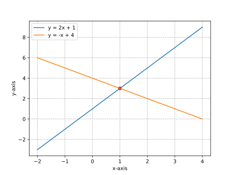
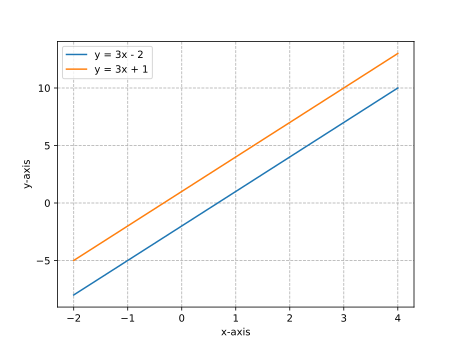
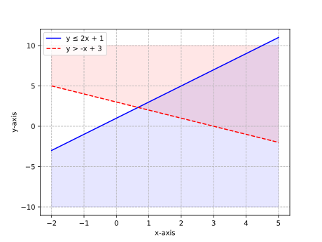
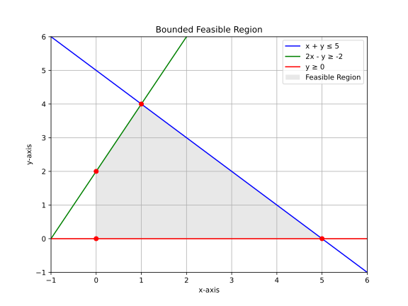
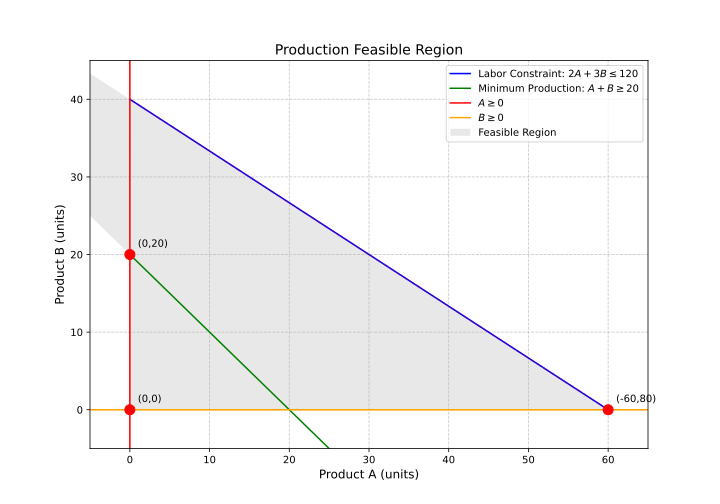

# **Linear Systems**

## Chapter 21: Solving Linear Systems by Graphing

### Definitions

-   **System of Linear Equations**: Set of two or more linear equations with same variables
-   **Solution**: Ordered pair (x,y) satisfying all equations
-   **Consistent System**: Has at least one solution
-   **Inconsistent System**: Has no solution
-   **Dependent System**: Infinite solutions

### Forms or Classifications

| Type         | Description        | Condition (y=mx+b) |
| ------------ | ------------------ | ------------------ |
| Independent  | One solution       | m₁ ≠ m₂            |
| Dependent    | Infinite solutions | m₁ = m₂, b₁ = b₂   |
| Inconsistent | No solution        | m₁ = m₂, b₁ ≠ b₂   |

### Examples

1. **One Solution System**

    - Problem: Solve graphically:
      \[
      \begin{cases}
      y = 2x + 1 \newline
      y = -x + 4
      \end{cases}
      \]
    - Solution:
        - Find intersection at (1,3)
        - Verify: 3 = 2(1)+1 and 3 = -(1)+4
        - Solution: (1,3)

    

2. **No Solution System**

    - Problem: Solve graphically:
      \[
      \begin{cases}
      y = 3x - 2 \newline
      y = 3x + 1
      \end{cases}
      \]
    - Solution:
        - Parallel lines (same slope=3)
        - Different y-intercepts (-2 vs 1)
        - No intersection → No solution

    

3. **Infinite Solutions System**
    - Problem: Solve graphically:
      \[
      \begin{cases}
      y = -2x + 3 \newline
      4x + 2y = 6
      \end{cases}
      \]
    - Solution:
        - Second equation simplifies to \( y = -2x + 3 \)
        - Identical lines → Infinite solutions

### Key Takeaways

> -   Graphing provides visual solution
> -   Three possible outcomes
> -   Best for integer solutions
> -   Check by substituting solution into both equations

## Chapter 22: Solving Linear Systems by Substitution

### Definitions

-   **Substitution Method**: Solve one equation for one variable, substitute into other
-   **Exact Solution**: Algebraic method avoids graphing inaccuracies
-   **Equivalent System**: Transformed system with same solution

### Examples

1. **Basic Substitution**

    - Problem: Solve:
      \[
      \begin{cases}
      x + y = 5 \newline
      2x - y = 1
      \end{cases}
      \]
    - Solution:
        - Solve 1st eq for y: y = 5 - x
        - Substitute into 2nd: 2x - (5 - x) = 1
        - Simplify: 3x - 5 = 1 → x = 2
        - Find y: y = 5 - 2 = 3
        - Solution: (2, 3)

2. **Fractional Coefficients**

    - Problem: Solve:
      \[
      \begin{cases}
      3x + 2y = 8 \newline
      y = \frac{1}{2}x - 1
      \end{cases}
      \]
    - Solution:
        - Substitute y: 3x + 2(½x - 1) = 8
        - Simplify: 4x - 2 = 8 → x = 2.5
        - Find y: y = ½(2.5) - 1 = 0.25
        - Solution: (2.5, 0.25)

3. **Real-World Application**
    - Problem: Ticket prices - child $3, adult $7. Total 100 tickets sold for $500.
    - Solution:
        - Let c=child, a=adult
        - c + a = 100 → c = 100 - a
        - 3c + 7a = 500
        - Substitute: 3(100 - a) + 7a = 500
        - Solve: a=50, c=50

### Key Takeaways

> -   Best when one variable is isolated
> -   Works for any linear system
> -   May introduce fractions
> -   Always verify solution

## Chapter 23: Solving Linear Systems by Elimination

### Definitions

-   **Elimination Method**: Add/subtract equations to eliminate variables
-   **Coefficient Scaling**: Multiply equations to match coefficients
-   **Equivalent System**: Maintains same solutions through operations

### Examples

1. **Simple Elimination**

    - Problem: Solve:
      \[
      \begin{cases}
      2x + y = 7 \newline
      x - y = -1
      \end{cases}
      \]
    - Solution:
        - Add equations: 3x = 6 → x = 2
        - Substitute: 2 - y = -1 → y = 3
        - Solution: (2, 3)

2. **Requiring Multiplication**

    - Problem: Solve:
      \[
      \begin{cases}
      3x + 2y = 4 \newline
      2x + 5y = 7
      \end{cases}
      \]
    - Solution:
        - Multiply 1st by 2: 6x + 4y = 8
        - Multiply 2nd by 3: 6x + 15y = 21
        - Subtract: -11y = -13 → y = 13/11
        - Find x: x = (4 - 2(13/11))/3 = 6/11
        - Solution: (6/11, 13/11)

3. **Special Cases**
    - Problem: Solve:
      \[
      \begin{cases}
      4x + 2y = 6 \newline
      2x + y = 4
      \end{cases}
      \]
    - Solution:
        - Multiply 2nd by 2: 4x + 2y = 8
        - Subtract from 1st: 0 = -2 → No solution

### Key Takeaways

> -   Best when coefficients are similar
> -   Can handle more complex systems
> -   Watch for special cases
> -   Systematic approach works for all systems

## Chapter 24: Applications of Linear Systems

### Definitions

-   **Mathematical Modeling**: Translating real situations to equations
-   **Variables**: Represent unknown quantities
-   **Constraints**: Conditions from problem statement

### Examples

1. **Mixture Problem**

    - Problem: How many liters of 20% and 50% solutions to make 10L of 32% solution?
    - Solution:
        - Let x = 20% sol, y = 50% sol
        - x + y = 10
        - 0.2x + 0.5y = 3.2
        - Solve: x = 6L, y = 4L

2. **Distance-Rate-Time**

    - Problem: Boat goes 24km downstream in 2h, upstream in 3h. Find boat and current speeds.
    - Solution:
        - Let b = boat speed, c = current
        - Down: 24 = 2(b + c)
        - Up: 24 = 3(b - c)
        - Solve: b = 10km/h, c = 2km/h

3. **Break-Even Analysis**
    - Problem: Company has $5000 fixed costs, $10 per unit cost, sells for $25. Find break-even point.
    - Solution:
        - Cost: C = 10x + 5000
        - Revenue: R = 25x
        - Set equal: 10x + 5000 = 25x → x = 333.33 units

### Key Takeaways

> -   Identify variables clearly
> -   Create equations from conditions
> -   Choose appropriate solving method
> -   Interpret solutions in context

## Chapter 25: Systems of Linear Inequalities

### Definitions

-   **Feasible Region**: Solution area satisfying all inequalities
-   **Boundary Line**: Graph of equality equation
-   **Test Point**: Determines shaded region

### Examples

1. **Basic System**

    - Problem: Graph:
      \[
      \begin{cases}
      y ≤ 2x + 1 \newline
      y > -x + 3
      \end{cases}
      \]
    - Solution:
        - Solid line for y = 2x + 1, shade below
        - Dashed line for y = - x + 3, shade above
        - Overlapping region is solution

    

2. **Bounded Feasible Region**

    - Problem: Graph:
      \[
      \begin{cases}
      x + y ≤ 5 \newline
      2x - y ≥ -2 \newline
      y ≥ 0
      \end{cases}
      \]
    - Solution:
        - Find vertices at intersections
        - Shade polygonal feasible region

    

3. **Real-World Application**

    - Problem: Production constraints - Product A needs 2h labor, B needs 3h. Maximum 120h available. Must produce at least 20 total items.
    - Solution:
        - Let a=Product A, b=Product B
        - 2a + 3b ≤ 120
        - a + b ≥ 20
        - a ≥ 0, b ≥ 0
        - Graph to find feasible production combinations

    

### Key Takeaways

> -   Graph each inequality separately
> -   Solution is intersection of all regions
> -   Dashed vs solid boundary lines matter
> -   Used in optimization problems
