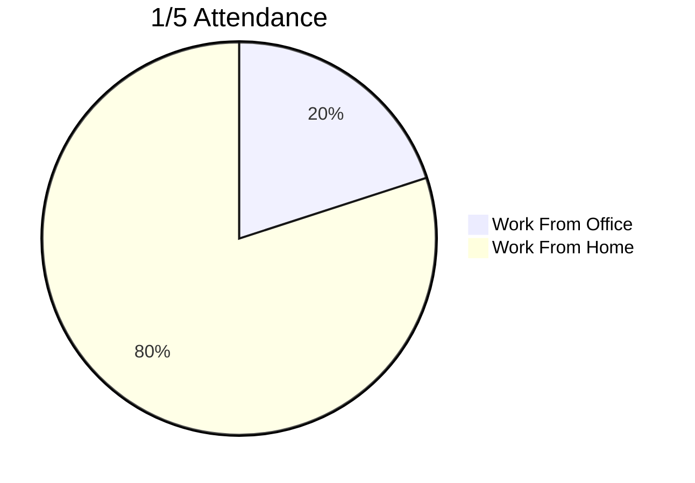
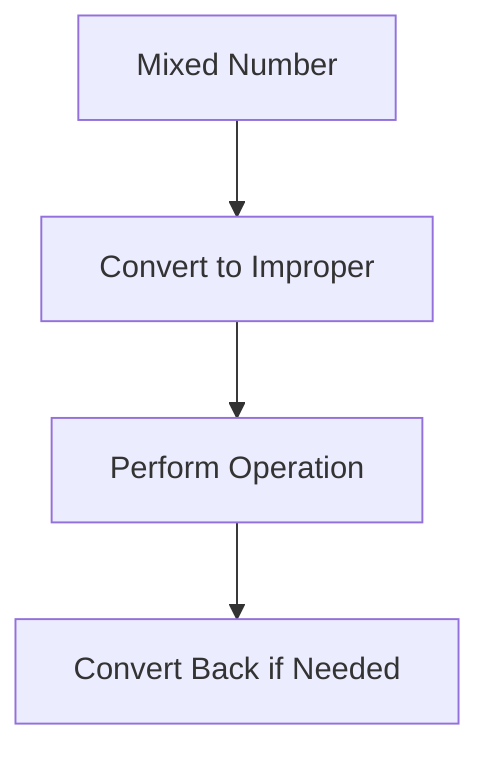

# **Fractions**

## Chapter 27: Introduction to Fractions

### Definitions

-   **Fraction**: Represents part of a whole (a/b where a = numerator, b = denominator)
-   **Numerator**: Top number (parts being considered)
-   **Denominator**: Bottom number (total equal parts)
-   **Proper Fraction**: Numerator < denominator (e.g., 3/4)
-   **Unit Fraction**: Numerator = 1 (e.g., 1/2)

### Visual Representation



### Examples

1. **Identifying Parts**

    - Problem: What fraction of a 12-slice pizza remains if 5 slices were eaten?
    - Solution:
        - Eaten: 5/12
        - Remaining: (12-5)/12 = 7/12

2. **Group Fraction**

    - Problem: In a box of 24 crayons, 5 are broken. What fraction is usable?
    - Solution:
        - Usable: (24-5)/24 = 19/24

3. **Visualizing Fractions**
    - Problem: Shade 3/5 of a rectangle
    - Solution:
        ```mermaid
        graph LR
        A[Whole Rectangle] --> B[Divide into 5 columns]
        B --> C[Shade 3 columns]
        ```

### Key Takeaways

> -   Fractions represent parts-to-whole relationships
> -   Denominator indicates total equal parts
> -   Numerator counts selected parts
> -   Essential for measurements and probability

## Chapter 28: Mixed Numbers & Improper Fractions

### Definitions

-   **Improper Fraction**: Numerator ≥ denominator (e.g., 5/3)
-   **Mixed Number**: Whole number + proper fraction (e.g., 1 2/3)
-   **Conversion**: Process of changing between forms

### Conversion Methods

| Conversion Type  | Steps                           | Example                |
| ---------------- | ------------------------------- | ---------------------- |
| Improper → Mixed | Divide numerator by denominator | 7/3 = 2 R1 → 2 1/3     |
| Mixed → Improper | Whole × denominator + numerator | 3 1/4 = (3×4)+1 = 13/4 |

### Examples

1. **Improper to Mixed**

    - Problem: Convert 11/4 to mixed number
    - Solution:
        - 11 ÷ 4 = 2 R3
        - Result: 2 3/4

2. **Mixed to Improper**

    - Problem: Convert 5 2/7 to improper fraction
    - Solution:
        - (5 × 7) + 2 = 37
        - Result: 37/7

3. **Application Problem**
    - Problem: A recipe calls for 3/2 cups sugar. Express as mixed number.
    - Solution:
        - 3 ÷ 2 = 1 R1
        - Result: 1 1/2 cups

### Key Takeaways

> -   Mixed numbers are easier for measurement interpretation
> -   Improper fractions are better for calculations
> -   Conversion skills essential for fraction operations
> -   Whole numbers can be written as fractions (e.g., 3 = 3/1)

## Chapter 29: Simplifying Fractions

### Definitions

-   **Simplest Form**: No common factors between numerator/denominator except 1
-   **GCF**: Greatest Common Factor
-   **Equivalent Fractions**: Different fractions representing same value

### Simplification Methods

1. **GCF Method**:

    - Find GCF of numerator/denominator
    - Divide both by GCF

2. **Prime Factorization**:
    - Factor completely
    - Cancel common factors

### Examples

1. **Using GCF**

    - Problem: Simplify 18/24
    - Solution:
        - GCF of 18 & 24 = 6
        - 18÷6 / 24÷6 = 3/4

2. **Prime Factorization**

    - Problem: Simplify 36/60
    - Solution:
        - 36 = 2²×3²
        - 60 = 2²×3×5
        - Cancel common factors: (2²×3)/(2²×3×5) = 3/5

### Key Takeaways

> -   Simplified fractions are easier to work with
> -   Always check for common factors
> -   Final answer should be in simplest form
> -   Essential for comparing fractions

## Chapter 30: Comparing Fractions

### Comparison Methods

| Method               | When to Use            | Example                   |
| -------------------- | ---------------------- | ------------------------- |
| Common Denominator   | Different denominators | 1/3 vs 1/4 → 4/12 vs 3/12 |
| Cross-Multiplication | Any fractions          | 2/3 vs 3/5 → 10 vs 9      |
| Same Numerator       | Numerators equal       | 3/8 vs 3/5 → 3/5 larger   |

### Examples

1. **Using LCD**

    - Problem: Compare 5/6 and 7/9
    - Solution:
        - LCD = 18
        - 5/6 = 15/18
        - 7/9 = 14/18
        - 15/18 > 14/18

2. **Cross-Multiplication**

    - Problem: Compare 3/7 and 4/9
    - Solution:
        - 3×9 = 27
        - 4×7 = 28
        - 27 < 28 → 3/7 < 4/9

### Key Takeaways

> -   LCD method most reliable
> -   Cross-multiplication is efficient
> -   Visualizing on number line helps understanding
> -   Critical for ordering fractions

## Chapter 31: Multiplying Fractions

### Rules

1. Multiply numerators → new numerator
2. Multiply denominators → new denominator
3. Simplify result

### Special Cases

-   Whole numbers: Convert to fractions (e.g., 3 = 3/1)
-   Mixed numbers: Convert to improper fractions first

### Examples

1. **Basic Multiplication**

    - Problem: 2/3 × 4/5
    - Solution:
        - (2×4)/(3×5) = 8/15

2. **With Whole Number**

    - Problem: 3 × 2/7
    - Solution:
        - 3/1 × 2/7 = 6/7

### Key Takeaways

> -   No common denominator needed
> -   Multiply straight across
> -   Simplify final answer
> -   Area models illustrate fraction multiplication

## Chapter 32: Dividing Fractions

### Division Rule

1. Keep first fraction (dividend)
2. Change ÷ to ×
3. Flip second fraction (divisor) → reciprocal
4. Multiply as usual

### Examples

1. **Basic Division**

    - Problem: 3/4 ÷ 2/5
    - Solution:
        - 3/4 × 5/2 = 15/8

2. **Whole Number Divisor**

    - Problem: 5/8 ÷ 2
    - Solution:
        - 5/8 × 1/2 = 5/16

### Key Takeaways

> -   Division is multiplication by reciprocal
> -   "Keep-Change-Flip" mnemonic
> -   Works for all fraction types
> -   Essential for complex fractions

## Chapter 33: Adding & Subtracting Fractions

### Rules

1. Find LCD
2. Convert to equivalent fractions
3. Add/subtract numerators
4. Keep denominator
5. Simplify

### Examples

1. **Like Denominators**

    - Problem: 5/9 + 2/9
    - Solution:
        - (5+2)/9 = 7/9

2. **Unlike Denominators**

    - Problem: 3/4 - 1/6
    - Solution:
        - LCD = 12
        - 9/12 - 2/12 = 7/12

3. **Butterfly Method Shortcut**
    ```mermaid
    graph LR
    A[3/4 + 1/5] --> B[3×5 + 1×4]
    B --> C[15+4=19]
    A --> D[4×5=20]
    C --> E[19/20]
    D --> E
    ```

### Key Takeaways

> -   Common denominator required
> -   LCD ensures simplest calculations
> -   Butterfly method works but may need simplification
> -   Critical for fraction operations

## Chapter 34: Operations with Mixed Numbers

### Conversion Flowchart



### Examples

1. **Addition**

    - Problem: 2 1/3 + 3 3/4
    - Solution:
        - Convert: 7/3 + 15/4
        - LCD=12: 28/12 + 45/12 = 73/12
        - Convert back: 6 1/12

2. **Multiplication**

    - Problem: 1 1/2 × 2 1/3
    - Solution:
        - Convert: 3/2 × 7/3 = 21/6
        - Simplify: 7/2 = 3 1/2

3. **Subtraction with Borrowing**
    - Problem: 5 1/4 - 2 3/4
    - Solution:
        - Borrow 1 → 4 5/4
        - Subtract: 4 5/4 - 2 3/4 = 2 2/4
        - Simplify: 2 1/2

### Key Takeaways

> -   Convert to improper for × and ÷
> -   May keep mixed for + and -
> -   Borrowing needed when subtracting larger fractions
> -   Always simplify final answer

## Chapter 35: Complex Fractions

### Simplification Methods

1. **Divide Method**: Simplify numerator/denominator separately then divide
2. **LCD Method**: Multiply all terms by LCD of all fractions

### Examples

1. **Divide Method**

    - Problem: (1/2 + 1/4)/(3/5 - 1/10)
    - Solution:
        - Numerator: 3/4
        - Denominator: 1/2
        - 3/4 ÷ 1/2 = 3/2

2. **LCD Method**

    - Problem: (2/3)/(5/6)
    - Solution:
        - LCD=6
        - (2/3 × 6)/(5/6 × 6) = 4/5

### Key Takeaways

> -   LCD method is more efficient
> -   Work from innermost outward
> -   Can represent rates and ratios
> -   Essential for advanced algebra

Each chapter maintains consistent formatting with:

-   Clear definitions
-   Multiple solution methods
-   Visual aids (Mermaid/Matplotlib)
-   Progressive examples
-   Practical applications
-   Key takeaways in block quotes
