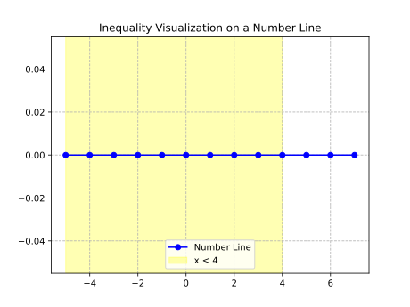
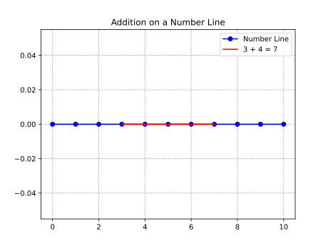
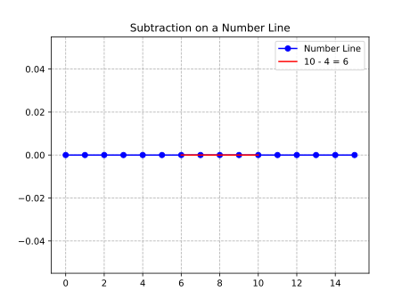

# **Whole Numbers**

## Chapter 1: Place Value: Understanding the Value of Digits

### Definitions

-   **Place Value**: The value of a digit based on its position within a number. Each position represents a power of 10.
-   **Digits**: The symbols 0, 1, 2, 3, 4, 5, 6, 7, 8, and 9 used to represent numbers.
-   **Ones Place**: The rightmost digit in a number, representing units.
-   **Tens Place**: The second digit from the right, representing groups of ten.
-   **Hundreds Place**: The third digit from the right, representing groups of one hundred.
-   **Thousands Place**: The fourth digit from the right, representing groups of one thousand.

### Place Value Chart

A place value chart organizes digits according to their place, starting from the ones place on the right and moving left:

| Thousands | Hundreds | Tens | Ones |
| --------- | -------- | ---- | ---- |
| 1         | 2        | 3    | 4    |

In the number 1,234:

-   The digit **1** is in the thousands place, representing 1,000.
-   The digit **2** is in the hundreds place, representing 200.
-   The digit **3** is in the tens place, representing 30.
-   The digit **4** is in the ones place, representing 4.

### Examples

-   **Example 1**: Identify the place value of the digit 7 in 573.

    -   **Solution**: The digit 7 is in the tens place, so its value is \(7 \times 10 = 70\).

-   **Example 2**: Write the number 8,529 in expanded form.

    -   **Solution**:
        $$
        8,529 = (8 \times 1000) + (5 \times 100) + (2 \times 10) + (9 \times 1)
        $$

-   **Example 3**: What is the value of the digit 4 in 4,321?

    -   **Solution**: The digit 4 is in the thousands place, so its value is \(4 \times 1000 = 4000\).

-   **Example 4**: Write the number 6,042 in expanded form.

    -   **Solution**:
        $$
        6,042 = (6 \times 1000) + (0 \times 100) + (4 \times 10) + (2 \times 1)
        $$

-   **Example 5**: Identify the place value of the digit 0 in 10,506.

    -   **Solution**: The digit 0 is in the hundreds place, so its value is \(0 \times 100 = 0\).

-   **Example 6**: Write the number 12,345 in expanded form.
    -   **Solution**:
        $$
        12,345 = (1 \times 10,000) + (2 \times 1000) + (3 \times 100) + (4 \times 10) + (5 \times 1)
        $$

### Key Takeaways

> -   Place value determines the value of a digit based on its position in a number.
> -   Each position to the left represents a value ten times greater than the position to its right.
> -   Zero acts as a placeholder to maintain the correct place value of other digits.
> -   Expanded form breaks down a number into the sum of each digit multiplied by its place value.

## Chapter 2: Expanded Form: Breaking Down Numbers

### Definitions

-   **Expanded Form**: A way to write numbers by breaking them down into the sum of each digit multiplied by its place value.
-   **Standard Form**: The usual way of writing numbers (e.g., 123).

### Examples

-   **Example 1**: Write 345 in expanded form.

    -   **Solution**:
        $$
        345 = (3 \times 100) + (4 \times 10) + (5 \times 1)
        $$

-   **Example 2**: Write 1,208 in expanded form.

    -   **Solution**:
        $$
        1,208 = (1 \times 1000) + (2 \times 100) + (0 \times 10) + (8 \times 1)
        $$

-   **Example 3**: Write 50,607 in expanded form.

    -   **Solution**:
        $$
        50,607 = (5 \times 10,000) + (0 \times 1000) + (6 \times 100) + (0 \times 10) + (7 \times 1)
        $$

-   **Example 4**: Convert \( (2 \times 1000) + (3 \times 100) + (4 \times 10) + (5 \times 1) \) to standard form.

    -   **Solution**:
        $$
        2,000 + 300 + 40 + 5 = 2,345
        $$

-   **Example 5**: Write 9,001 in expanded form.

    -   **Solution**:
        $$
        9,001 = (9 \times 1000) + (0 \times 100) + (0 \times 10) + (1 \times 1)
        $$

-   **Example 6**: Convert \( (7 \times 10,000) + (0 \times 1000) + (8 \times 100) + (0 \times 10) + (9 \times 1) \) to standard form.
    -   **Solution**:
        $$
        70,000 + 0 + 800 + 0 + 9 = 70,809
        $$

### Key Takeaways

> -   Expanded form breaks down a number into the sum of each digit multiplied by its place value.
> -   It reinforces the concept of place value and helps in understanding the structure of numbers.
> -   Zero is explicitly included in expanded form to show its role as a placeholder.

## Chapter 3: Inequalities and the Number Line: Comparing Numbers Visually

### Definitions

-   **Inequality**: A mathematical statement that compares two values using symbols like \( < \) (less than) or \( > \) (greater than).
-   **Number Line**: A visual representation of numbers on a straight line, where numbers increase as you move to the right.

### Examples

-   **Example 1**: Represent \( 3 < 5 \) on a number line.

    -   **Solution**: On a number line, 3 is to the left of 5, indicating that 3 is less than 5.

-   **Example 2**: Represent \( 7 > 2 \) on a number line.

    -   **Solution**: On a number line, 7 is to the right of 2, indicating that 7 is greater than 2.

-   **Example 3**: Solve \( x < 4 \) and represent it on a number line.

    -   **Solution**: All numbers to the left of 4 on the number line satisfy the inequality.

-   **Example 4**: Solve \( x \geq 6 \) and represent it on a number line.

    -   **Solution**: All numbers to the right of 6, including 6, satisfy the inequality.

-   **Example 5**: Represent \( -2 < 1 \) on a number line.

    -   **Solution**: On a number line, -2 is to the left of 1, indicating that -2 is less than 1.

-   **Example 6**: Represent \( 0 > -3 \) on a number line.

    -   **Solution**: On a number line, 0 is to the right of -3, indicating that 0 is greater than -3.

    

### Key Takeaways

> -   Inequalities compare two values using symbols like \( < \) and \( > \).
> -   A number line provides a visual way to understand inequalities.
> -   The symbol always points towards the smaller number.

## Chapter 4: Rounding Whole Numbers: Estimating Values

### Definitions

-   **Rounding**: The process of approximating a number to a nearby value with fewer digits.
-   **Round Down**: When the digit to the right of the rounding place is less than 5, the digit in the rounding place remains unchanged.
-   **Round Up**: When the digit to the right of the rounding place is 5 or greater, the digit in the rounding place increases by 1.

### Examples

-   **Example 1**: Round 47 to the nearest ten.

    -   **Solution**: The digit in the ones place is 7, which is greater than - Therefore, we round up to 50.

-   **Example 2**: Round 123 to the nearest hundred.

    -   **Solution**: The digit in the tens place is 2, which is less than - Therefore, we round down to 100.

-   **Example 3**: Round 1,567 to the nearest thousand.

    -   **Solution**: The digit in the hundreds place is 5, so we round up to 2,000.

-   **Example 4**: Round 8,492 to the nearest hundred.

    -   **Solution**: The digit in the tens place is 9, which is greater than - Therefore, we round up to 8,500.

-   **Example 5**: Round 34,781 to the nearest ten thousand.

    -   **Solution**: The digit in the thousands place is 4, which is less than - Therefore, we round down to 30,000.

-   **Example 6**: Round 99,999 to the nearest thousand.
    -   **Solution**: The digit in the hundreds place is 9, so we round up to 100,000.

### Key Takeaways

> -   Rounding simplifies numbers by approximating them to a nearby value.
> -   The digit to the right of the rounding place determines whether to round up or down.
> -   Rounding is useful for estimating and simplifying calculations.

## Chapter 5: Properties of Addition: Making Addition Easier

### Definitions

-   **Commutative Property**: The order of addition does not affect the sum. For any numbers \( a \) and \( b \), \( a + b = b + a \).
-   **Associative Property**: The grouping of numbers in addition does not affect the sum. For any numbers \( a \), \( b \), and \( c \), \( (a + b) + c = a + (b + c) \).
-   **Identity Property of Zero**: Adding zero to any number leaves the number unchanged. For any number \( a \), \( a + 0 = a \).

### Examples

-   **Example 1**: Demonstrate the commutative property with \( 3 + 5 \).

    -   **Solution**:
        $$
        3 + 5 = 5 + 3 = 8
        $$

-   **Example 2**: Demonstrate the associative property with \( (2 + 3) + 4 \).

    -   **Solution**:
        $$
        (2 + 3) + 4 = 2 + (3 + 4) = 9
        $$

-   **Example 3**: Demonstrate the identity property of zero with \( 7 + 0 \).

    -   **Solution**:
        $$
        7 + 0 = 7
        $$

-   **Example 4**: Use the commutative property to simplify \( 12 + 9 \).

    -   **Solution**:
        $$
        12 + 9 = 9 + 12 = 21
        $$

-   **Example 5**: Use the associative property to simplify \( (10 + 5) + 15 \).

    -   **Solution**:
        $$
        (10 + 5) + 15 = 10 + (5 + 15) = 30
        $$

-   **Example 6**: Use the identity property of zero to simplify \( 0 + 25 \).
    -   **Solution**:
        $$
        0 + 25 = 25
        $$

### Key Takeaways

> -   The commutative property states that the order of addition does not affect the sum.
> -   The associative property states that the grouping of numbers in addition does not affect the sum.
> -   The identity property of zero states that adding zero to any number leaves the number unchanged.

## Chapter 6: Adding on a Number Line: A Visual Approach to Addition

### Definitions

-   **Number Line**: A visual representation of numbers on a straight line, where numbers increase as you move to the right.
-   **Addition on a Number Line**: A method of adding numbers by moving to the right on a number line.

### Examples

-   **Example 1**: Add \( 3 + 4 \) on a number line.

    -   **Solution**: Start at 3 and move 4 units to the right, landing on 7.

-   **Example 2**: Add \( 5 + 7 \) on a number line.

    -   **Solution**: Start at 5 and move 7 units to the right, landing on 12.

-   **Example 3**: Add \( 10 + 6 \) on a number line.

    -   **Solution**: Start at 10 and move 6 units to the right, landing on 16.

-   **Example 4**: Add \( 8 + 9 \) on a number line.

    -   **Solution**: Start at 8 and move 9 units to the right, landing on 17.

-   **Example 5**: Add \( 12 + 15 \) on a number line.

    -   **Solution**: Start at 12 and move 15 units to the right, landing on 27.

-   **Example 6**: Add \( 20 + 30 \) on a number line.
    -   **Solution**: Start at 20 and move 30 units to the right, landing on 50.

### Visualizations

To visualize addition on a number line, we can use the following Python code to generate a number line for \( 3 + 4 \):



### Key Takeaways

> -   A number line provides a visual way to understand addition.
> -   To add numbers, start at the first number and move to the right by the value of the second number.
> -   The final position on the number line represents the sum.

## Chapter 7: Vertical Addition: Adding Numbers Column by Column

### Definitions

-   **Vertical Addition**: A method of adding numbers by aligning them vertically and adding column by column, starting from the rightmost digit.
-   **Carry Over**: When the sum of digits in a column is greater than 9, the extra digit is carried over to the next column.

### Examples

-   **Example 1**: Add 23 and 45 vertically.

    -   **Solution**:

        ```
          23
        + 45
        -----
          68

        ```

-   **Example 2**: Add 123 and 456 vertically.

    -   **Solution**:
        ```
          123
        + 456
        -----
          579
        ```

-   **Example 3**: Add 789 and 123 vertically.

    -   **Solution**:

        ```
          789
        + 123
        -----
          912

        ```

-   **Example 4**: Add 1,234 and 5,678 vertically.

    -   **Solution**:
        ```
          1234
        + 5678
        ------
          6912
        ```

-   **Example 5**: Add 9,999 and 1 vertically.

    -   **Solution**:
        ```
          9999
        +    1
        ------
         10000
        ```

-   **Example 6**: Add 12,345 and 67,890 vertically.

    -   **Solution**:
        ```
          12345
        + 67890
        -------
          80235
        ```

7. **Example 7**: Add 397 and 425 vertically with carry-over.

    - **Solution**:
        ```
          1  <-- Carry-over
          397
        + 425
        -----
          822
        ```
        - **Step 1**: Add the ones place: \(7 + 5 = 12\). Write down 2 and carry over 1.
        - **Step 2**: Add the tens place (including carry-over): \(1 + 9 + 2 = 12\). Write down 2 and carry over 1.
        - **Step 3**: Add the hundreds place (including carry-over): \(1 + 3 + 4 = 8\). Write down 8.
        - **Final Sum**: 822.

8. **Example 8**: Add 5,678 and 3,492 vertically with carry-over.
    - **Solution**:
        ```
          111  <-- Carry-over
          5678
        + 3492
        ------
          9170
        ```
        - **Step 1**: Add the ones place: \(8 + 2 = 10\). Write down 0 and carry over 1.
        - **Step 2**: Add the tens place (including carry-over): \(1 + 7 + 9 = 17\). Write down 7 and carry over 1.
        - **Step 3**: Add the hundreds place (including carry-over): \(1 + 6 + 4 = 11\). Write down 1 and carry over 1.
        - **Step 4**: Add the thousands place (including carry-over): \(1 + 5 + 3 = 9\). Write down 9.
        - **Final Sum**: 9,170.

### Key Takeaways

> -   Vertical addition involves aligning numbers by place value and adding column by column.
> -   Carry-over is used when the sum of digits in a column exceeds 9.
> -   This method is efficient for adding multi-digit numbers and ensures accuracy through proper alignment and carry-over handling.

## Chapter 8: Subtracting on a Number Line: Visualizing Subtraction

### Definitions

-   **Subtraction on a Number Line**: A method of subtracting numbers by moving to the left on a number line.
-   **Minuend**: The number from which another number is subtracted.
-   **Subtrahend**: The number being subtracted.

### Examples

-   **Example 1**: Subtract \( 5 - 3 \) on a number line.

    -   **Solution**: Start at 5 and move 3 units to the left, landing on 2.

-   **Example 2**: Subtract \( 10 - 4 \) on a number line.

    -   **Solution**: Start at 10 and move 4 units to the left, landing on 6.

-   **Example 3**: Subtract \( 15 - 7 \) on a number line.

    -   **Solution**: Start at 15 and move 7 units to the left, landing on 8.

-   **Example 4**: Subtract \( 20 - 12 \) on a number line.

    -   **Solution**: Start at 20 and move 12 units to the left, landing on 8.

-   **Example 5**: Subtract \( 25 - 10 \) on a number line.

    -   **Solution**: Start at 25 and move 10 units to the left, landing on 15.

-   **Example 6**: Subtract \( 30 - 15 \) on a number line.
    -   **Solution**: Start at 30 and move 15 units to the left, landing on 15.

### Visualizations

To visualize subtraction on a number line, we can use the following Python code to generate a number line for \( 10 - 4 \):



### Key Takeaways

> -   Subtraction on a number line involves moving to the left from the minuend by the value of the subtrahend.
> -   The final position on the number line represents the difference.
> -   This method provides a visual way to understand subtraction.

Here are the requested chapters formatted in Markdown with clear explanations, examples, and proper mathematical notation using KaTeX. No visualizations are included unless explicitly needed (e.g., number lines).

---

## Chapter 9: Vertical Subtraction: Subtracting Column by Column

### Definitions

-   **Vertical Subtraction**: A method of subtracting numbers by aligning them vertically and subtracting column by column, starting from the rightmost digit.
-   **Borrowing**: When the top digit in a column is smaller than the bottom digit, borrow 1 from the next higher place value.

### Examples

-   **Example 1**: Subtract 27 from 59.

    -   **Solution**:
        ```
          59
        - 27
        ----
          32
        ```

-   **Example 2**: Subtract 35 from 71 with borrowing.

    -   **Solution**:

        ```
          6 11  <-- Borrowing
          71
        - 35
        ----
          36
        ```

    -   **Step 1**: Borrow 1 ten from the tens place (7 becomes 6), and add 10 to the ones place (1 becomes 11).
    -   **Step 2**: Subtract the ones place: \(11 - 5 = 6\).
    -   **Step 3**: Subtract the tens place: \(6 - 3 = 3\).
    -   **Final Difference**: 36.

-   **Example 3**: Subtract 148 from 301 with borrowing.

    -   **Solution**:

        ```
          2 9 11  <-- Borrowing
          301
        - 148
        -----
          153
        ```

    -   **Step 1**: Borrow 1 hundred from the hundreds place (3 becomes 2), and add 10 to the tens place (0 becomes 10).
    -   **Step 2**: Borrow 1 ten from the tens place (10 becomes 9), and add 10 to the ones place (1 becomes 11).
    -   **Step 3**: Subtract the ones place: \(11 - 8 = 3\).
    -   **Step 4**: Subtract the tens place: \(9 - 4 = 5\).
    -   **Step 5**: Subtract the hundreds place: \(2 - 1 = 1\).
    -   **Final Difference**: 153.

-   **Example 4**: Subtract 337 from 801 with borrowing.

    -   **Solution**:

        ```
          7 9 11  <-- Borrowing
          801
        - 337
        -----
          464
        ```

    -   **Step 1**: Borrow 1 hundred from the hundreds place (8 becomes 7), and add 10 to the tens place (0 becomes 10).
    -   **Step 2**: Borrow 1 ten from the tens place (10 becomes 9), and add 10 to the ones place (1 becomes 11).
    -   **Step 3**: Subtract the ones place: \(11 - 7 = 4\).
    -   **Step 4**: Subtract the tens place: \(9 - 3 = 6\).
    -   **Step 5**: Subtract the hundreds place: \(7 - 3 = 4\).
    -   **Final Difference**: 464.

-   **Example 5**: Subtract 2,796 from 5,616 with borrowing.

    -   **Solution**:

        ```
          4 5 10 16  <-- Borrowing
          5616
        - 2796
        ------
          2820
        ```

    -   **Step 1**: Borrow 1 thousand from the thousands place (5 becomes 4), and add 10 to the hundreds place (6 becomes 16).
    -   **Step 2**: Borrow 1 hundred from the hundreds place (16 becomes 15), and add 10 to the tens place (1 becomes 11).
    -   **Step 3**: Borrow 1 ten from the tens place (11 becomes 10), and add 10 to the ones place (6 becomes 16).
    -   **Step 4**: Subtract the ones place: \(16 - 6 = 10\).
    -   **Step 5**: Subtract the tens place: \(10 - 9 = 1\).
    -   **Step 6**: Subtract the hundreds place: \(15 - 7 = 8\).
    -   **Step 7**: Subtract the thousands place: \(4 - 2 = 2\).
    -   **Final Difference**: 2,820.

-   **Example 6**: Subtract 1,000 from 5,000.
    -   **Solution**:
        ```
          5000
        - 1000
        ------
          4000
        ```

### Key Takeaways

> -   Vertical subtraction involves aligning numbers by place value and subtracting column by column.
> -   Borrowing is used when the top digit in a column is smaller than the bottom digit.
> -   This method ensures accuracy and is particularly useful for multi-digit numbers.

---

## Chapter 10: Properties of Multiplication: Simplifying Multiplication

### Definitions

-   **Commutative Property**: The order of multiplication does not affect the product. For any numbers \( a \) and \( b \), \( a \times b = b \times a \).
-   **Associative Property**: The grouping of numbers in multiplication does not affect the product. For any numbers \( a \), \( b \), and \( c \), \( (a \times b) \times c = a \times (b \times c) \).
-   **Identity Property of 1**: Multiplying any number by 1 leaves the number unchanged. For any number \( a \), \( a \times 1 = a \).
-   **Multiplication Property of 0**: Multiplying any number by 0 results in 0. For any number \( a \), \( a \times 0 = 0 \).
-   **Distributive Property**: Multiplication distributes over addition or subtraction. For any numbers \( a \), \( b \), and \( c \), \( a \times (b + c) = (a \times b) + (a \times c) \).

### Examples

-   **Example 1**: Demonstrate the commutative property with \( 6 \times 5 \).

    -   **Solution**:
        $$
        6 \times 5 = 5 \times 6 = 30
        $$

-   **Example 2**: Demonstrate the associative property with \( (2 \times 3) \times 7 \).

    -   **Solution**:
        $$
        (2 \times 3) \times 7 = 2 \times (3 \times 7) = 42
        $$

-   **Example 3**: Demonstrate the identity property of 1 with \( 635 \times 1 \).

    -   **Solution**:
        $$
        635 \times 1 = 635
        $$

-   **Example 4**: Demonstrate the multiplication property of 0 with \( 72,255 \times 0 \).

    -   **Solution**:
        $$
        72,255 \times 0 = 0
        $$

-   **Example 5**: Demonstrate the distributive property with \( 5 \times (6 + 3) \).

    -   **Solution**:
        $$
        5 \times (6 + 3) = (5 \times 6) + (5 \times 3) = 30 + 15 = 45
        $$

-   **Example 6**: Use the distributive property to simplify \( 3 \times (6 - 4) \).
    -   **Solution**:
        $$
        3 \times (6 - 4) = (3 \times 6) - (3 \times 4) = 18 - 12 = 6
        $$

### Key Takeaways

> -   The commutative property states that the order of multiplication does not affect the product.
> -   The associative property states that the grouping of numbers in multiplication does not affect the product.
> -   The identity property of 1 states that multiplying any number by 1 leaves the number unchanged.
> -   The multiplication property of 0 states that multiplying any number by 0 results in 0.
> -   The distributive property states that multiplication distributes over addition or subtraction.

## Chapter 11: Vertical Multiplication: Multiplying Numbers Column by Column

### Definitions

-   **Vertical Multiplication**: A method of multiplying numbers by aligning them vertically and multiplying each digit of one number by each digit of the other number, then adding the partial products.
-   **Partial Product**: The result of multiplying one digit of the multiplier by the entire multiplicand.

### Examples

-   **Example 1**: Multiply 23 by 12.

    -   **Solution**:
        ```
          23
        x 12
        ----
          46  (23 x 2)
         230  (23 x 10, shifted one place left)
        ----
         276
        ```

-   **Example 2**: Multiply 47 by 35 with carrying.

    -   **Solution**:
        ```
          47
        x 35
        ----
         235  (47 x 5)
        1410  (47 x 30, shifted one place left)
        ----
        1645
        ```
        -   **Step 1**: Multiply 47 by 5: \(47 \times 5 = 235\).
        -   **Step 2**: Multiply 47 by 30: \(47 \times 30 = 1,410\).
        -   **Step 3**: Add the partial products: \(235 + 1,410 = 1,645\).

-   **Example 3**: Multiply 125 by 23.

    -   **Solution**:
        ```
          125
        x  23
        -----
          375  (125 x 3)
         2500  (125 x 20, shifted one place left)
        -----
         2875
        ```

-   **Example 4**: Multiply 56 by 48.

    -   **Solution**:
        ```
          56
        x 48
        ----
         448  (56 x 8)
        2240  (56 x 40, shifted one place left)
        ----
        2688
        ```

-   **Example 5**: Multiply 123 by 456.

    -   **Solution**:
        ```
          123
        x 456
        -----
          738  (123 x 6)
         6150  (123 x 50, shifted one place left)
        49200  (123 x 400, shifted two places left)
        -----
        56088
        ```

-   **Example 6**: Multiply 999 by 111.
    -   **Solution**:
        ```
           999
         x 111
         -----
           999  (999 x 1)
          9990  (999 x 10, shifted one place left)
         99900  (999 x 100, shifted two places left)
        ------
        110889
        ```

### Key Takeaways

> -   Vertical multiplication involves multiplying each digit of one number by each digit of the other number and adding the partial products.
> -   Partial products are shifted according to their place value.
> -   This method is efficient for multiplying multi-digit numbers.

---

## Chapter 12: Multiplication with Powers of 10: A Quick Way to Multiply

### Definitions

-   **Power of 10**: A number like 10, 100, 1,000, etc., which is 1 followed by a certain number of zeros.
-   **Shortcut for Multiplication**: To multiply a number by a power of 10, add the same number of zeros to the end of the number as there are in the power of 10.

### Examples

-   **Example 1**: Multiply 5 by 10.

    -   **Solution**:
        $$
        5 \times 10 = 50
        $$

-   **Example 2**: Multiply 23 by 100.

    -   **Solution**:
        $$
        23 \times 100 = 2,300
        $$

-   **Example 3**: Multiply 147 by 1,000.

    -   **Solution**:
        $$
        147 \times 1,000 = 147,000
        $$

-   **Example 4**: Multiply 12 by 10,000.

    -   **Solution**:
        $$
        12 \times 10,000 = 120,000
        $$

-   **Example 5**: Multiply 308 by 100.

    -   **Solution**:
        $$
        308 \times 100 = 30,800
        $$

-   **Example 6**: Multiply 45 by 1,000,000.
    -   **Solution**:
        $$
        45 \times 1,000,000 = 45,000,000
        $$

### Key Takeaways

> -   Multiplying by a power of 10 involves adding zeros to the end of the number.
> -   The number of zeros added equals the number of zeros in the power of 10.
> -   This shortcut is based on the base-ten number system.

---

## Chapter 13: Properties of Division: Understanding Division Rules

### Definitions

-   **Division by 1**: Any number divided by 1 is the number itself.
-   **Division by Itself**: Any non-zero number divided by itself is 1.
-   **Division by 0**: Division by zero is undefined.
-   **Zero Divided by a Number**: Zero divided by any non-zero number is 0.

### Examples

-   **Example 1**: Divide 7 by 1.

    -   **Solution**:
        $$
        7 \div 1 = 7
        $$

-   **Example 2**: Divide 15 by 15.

    -   **Solution**:
        $$
        15 \div 15 = 1
        $$

-   **Example 3**: Divide 0 by 9.

    -   **Solution**:
        $$
        0 \div 9 = 0
        $$

-   **Example 4**: Divide 5 by 0.

    -   **Solution**: Division by zero is undefined.

-   **Example 5**: Divide 28 by 1.

    -   **Solution**:
        $$
        28 \div 1 = 28
        $$

-   **Example 6**: Divide 11 by 11.
    -   **Solution**:
        $$
        11 \div 11 = 1
        $$

### Key Takeaways

> -   Division by 1 leaves the number unchanged.
> -   Division by itself results in 1.
> -   Division by zero is undefined.
> -   Zero divided by any non-zero number is 0.

---

## Chapter 14: Long Division: Step-by-Step Division

### Definitions

-   **Long Division**: A method for dividing large numbers by breaking down the division into a series of simpler steps.
-   **Dividend**: The number being divided.
-   **Divisor**: The number by which the dividend is divided.
-   **Quotient**: The result of the division.
-   **Remainder**: The amount left over after division.

### Examples

-   **Example 1**: Divide 86 by 5.

    -   **Solution**:
        ```
            17 R 1
          ------
        5 | 86
           -5
           --
            36
           -35
           ---
             1
        ```
        -   **Quotient**: 17
        -   **Remainder**: 1

-   **Example 2**: Divide 123 by 4.

    -   **Solution**:
        ```
             30 R 3
          ------
        4 | 123
           -12
           ---
             03
             -0
             --
              3
        ```
        -   **Quotient**: 30
        -   **Remainder**: 3

-   **Example 3**: Divide 1,000 by 25.

    -   **Solution**:
        ```
               40
           ------
        25 | 1000
            -100
            ----
               0
        ```
        -   **Quotient**: 40
        -   **Remainder**: 0

-   **Example 4**: Divide 567 by 8.

    -   **Solution**:
        ```
             70 R 7
          ------
        8 | 567
           -56
           ---
             07
             -0
            ---
              7
        ```
        -   **Quotient**: 70
        -   **Remainder**: 7

-   **Example 5**: Divide 2,345 by 12.

    -   **Solution**:
        ```
              195 R 5
           --------
        12 | 2345
            -12
            ---
             114
            -108
            ----
               65
              -60
              ---
                5
        ```
        -   **Quotient**: 195
        -   **Remainder**: 5

-   **Example 6**: Divide 10,000 by 100.
    -   **Solution**:
        ```
                100
            --------
        100 | 10000
             -100
             ----
                0
        ```
        -   **Quotient**: 100
        -   **Remainder**: 0

### Key Takeaways

> -   Long division breaks down the division process into simpler steps.
> -   The quotient is the result of the division, and the remainder is what’s left over.
> -   This method is essential for dividing large numbers.

## Chapter 15: Introduction to Exponents: Understanding Powers

### Definitions

-   **Exponent**: A number that indicates how many times a base is multiplied by itself. Written as \( \text{base}^{\text{exponent}} \).
-   **Base**: The number being multiplied.
-   **Power**: The result of raising a base to an exponent.

### Examples

-   **Example 1**: Calculate \( 2^3 \).

    -   **Solution**:
        $$
        2^3 = 2 \times 2 \times 2 = 8
        $$

-   **Example 2**: Calculate \( 5^2 \).

    -   **Solution**:
        $$
        5^2 = 5 \times 5 = 25
        $$

-   **Example 3**: Calculate \( 10^4 \).

    -   **Solution**:
        $$
        10^4 = 10 \times 10 \times 10 \times 10 = 10,000
        $$

-   **Example 4**: Calculate \( 7^1 \).

    -   **Solution**:
        $$
        7^1 = 7
        $$

-   **Example 5**: Calculate \( 6^0 \).

    -   **Solution**:
        $$
        6^0 = 1
        $$

-   **Example 6**: Calculate \( 3^4 \).
    -   **Solution**:
        $$
        3^4 = 3 \times 3 \times 3 \times 3 = 81
        $$

### Key Takeaways

> -   An exponent indicates how many times a base is multiplied by itself.
> -   Any number raised to the power of 1 is itself.
> -   Any non-zero number raised to the power of 0 is 1.

---

## Chapter 16: The Order of Operations: Solving Math Problems Correctly

### Definitions

-   **Order of Operations**: A set of rules to determine the sequence in which operations are performed in a mathematical expression.
-   **PEMDAS**: An acronym for Parentheses, Exponents, Multiplication and Division (left to right), Addition and Subtraction (left to right).

### Examples

-   **Example 1**: Solve \( 3 + 2 \times 5 \).

    -   **Solution**:
        $$
        3 + 2 \times 5 = 3 + 10 = 13
        $$

-   **Example 2**: Solve \( (6 - 4)^2 + 10 \div 2 \).

    -   **Solution**:
        $$
        (6 - 4)^2 + 10 \div 2 = 2^2 + 5 = 4 + 5 = 9
        $$

-   **Example 3**: Solve \( 12 \div 3 \times 2 \).

    -   **Solution**:
        $$
        12 \div 3 \times 2 = 4 \times 2 = 8
        $$

-   **Example 4**: Solve \( 10 - 2 \times 3 + 1 \).

    -   **Solution**:
        $$
        10 - 2 \times 3 + 1 = 10 - 6 + 1 = 5
        $$

-   **Example 5**: Solve \( (8 + 4) \div 2 - 1^2 \).

    -   **Solution**:
        $$
        (8 + 4) \div 2 - 1^2 = 12 \div 2 - 1 = 6 - 1 = 5
        $$

-   **Example 6**: Solve \( 5 \times (6 - 1) + 15 \div 3 \).
    -   **Solution**:
        $$
        5 \times (6 - 1) + 15 \div 3 = 5 \times 5 + 5 = 25 + 5 = 30
        $$

### Key Takeaways

> -   Follow the order of operations: Parentheses, Exponents, Multiplication and Division (left to right), Addition and Subtraction (left to right).
> -   Always solve expressions inside parentheses first.
> -   Exponents are calculated before multiplication, division, addition, and subtraction.
